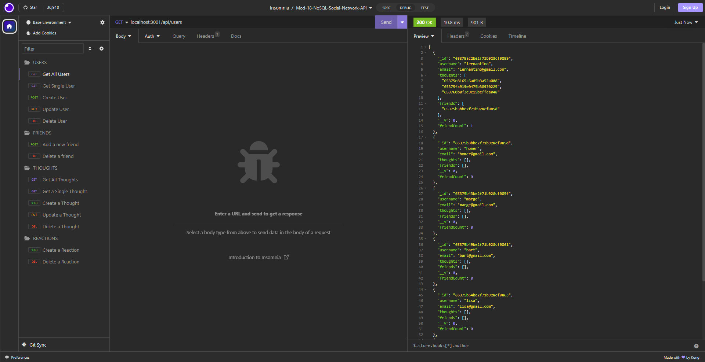

# Mod-18-NoSQL-Social-Network-API

## Description

A node.js backend application that provides CRUD NoSQL (MongoDB) database usage for a social media platform where users can share their thoughts and add reactions to those thoughts.

## Installation

Project has a dependencies the user must run npm install to include the needed libraries.  Additionally, node.js must be installed.

## Usage

Run npm start from the installed folder. 

Sample usage video link: [Here](https://youtu.be/aFP6imMo-cA)

The following image shows the application's appearance and functionality in insomnia:

## Credits

N/A

## License

N/A
